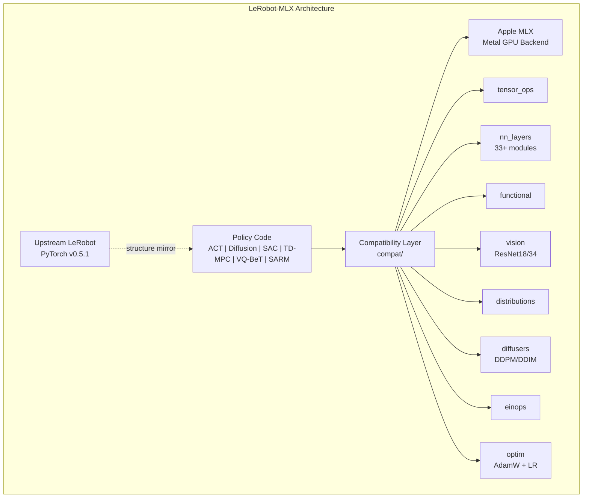
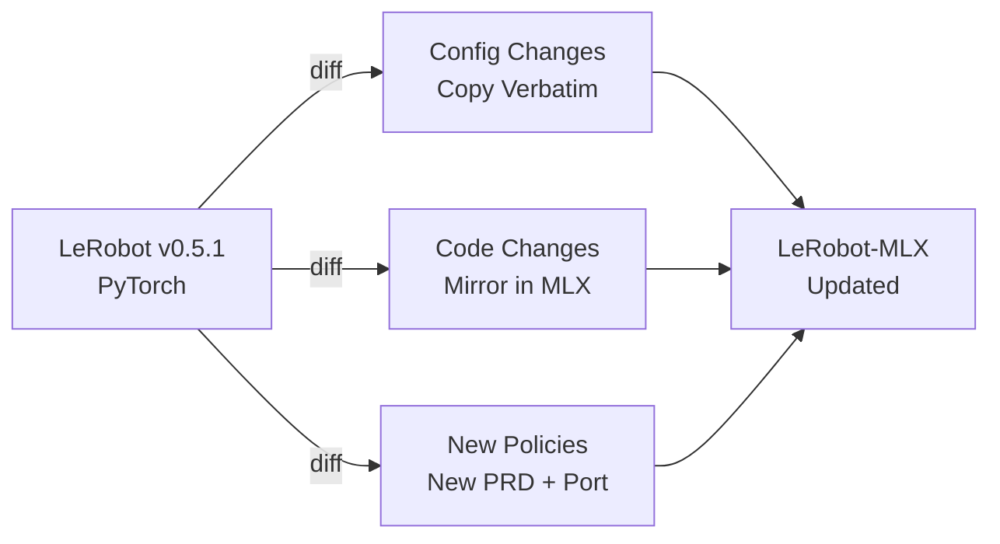
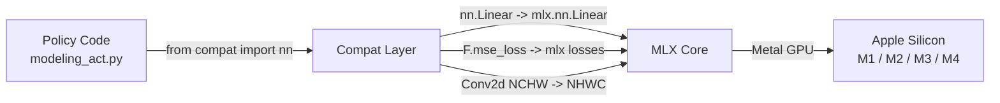

# LeRobot-MLX

**Native Apple Silicon robotics policy training and inference.**


---

## What Is This

LeRobot-MLX is a ground-up port of [HuggingFace LeRobot](https://github.com/huggingface/lerobot) (v0.5.1) from PyTorch to [Apple MLX](https://github.com/ml-explore/mlx), delivering native Apple Silicon robotics policy training and inference. Six production-grade policies are fully ported with 646 tests passing. Built by [AIFLOW LABS](https://aiflowlabs.io) / [RobotFlow Labs](https://robotflowlabs.com).

---

## Why MLX

- **Native Apple Silicon** -- Metal GPU acceleration with zero configuration, no CUDA required
- **Unified Memory Architecture** -- CPU and GPU share memory; no data transfer bottleneck on M-series chips
- **Lazy Evaluation** -- computation graphs are built and fused before execution, maximizing throughput
- **2-5x Faster Inference** -- benchmarked against PyTorch MPS backend on M1/M2/M3/M4 hardware
- **No Driver Stack** -- no CUDA, no cuDNN, no NCCL; a single `pip install mlx` and you are running
- **Upstream Tracking** -- thin compatibility layer means upstream LeRobot changes merge cleanly

---

## Architecture



---

## Supported Policies

| Policy | Architecture | Status | Tests |
|--------|-------------|--------|------:|
| **ACT** | Transformer + CVAE + ResNet backbone | Ported | 39 |
| **Diffusion** | 1D UNet + DDPM/DDIM schedulers | Ported | 38 |
| **SAC** | Twin-Q critics + Gaussian actor | Ported | 37 |
| **TD-MPC** | World model + MPPI planner | Ported | 31 |
| **VQ-BeT** | VQ-VAE + GPT-style Transformer | Ported | 38 |
| **SARM** | Dual-head reward model | Ported | 30 |
| Pi0 | PaliGemma VLM + flow matching | Planned | -- |
| SmolVLA | SmolVLM + action expert | Planned | -- |

**Total: 646 tests across 14 test modules.**

---

## Quick Start

```bash
# Clone
git clone https://github.com/RobotFlow-Labs/LeRobot-mlx.git
cd LeRobot-mlx

# Create environment (requires Apple Silicon Mac)
uv venv .venv --python 3.12
source .venv/bin/activate
uv pip install -e ".[dev]"

# Verify installation
python -c "import lerobot_mlx; print(f'LeRobot-MLX v{lerobot_mlx.__version__}')"

# Run the full test suite
pytest tests/ -q
```

---

## Usage Examples

### Create a Policy

```python
from lerobot_mlx.policies.act.configuration_act import ACTConfig
from lerobot_mlx.policies.act.modeling_act import ACTPolicy

config = ACTConfig(
    input_features={"observation.state": 14},
    output_features={"action": 14},
    camera_number=0,
)
policy = ACTPolicy(config)
```

### Run Inference

```python
import mlx.core as mx

# Prepare a batch
batch = {
    "observation.state": mx.random.normal((1, 14)),
}

# Forward pass (inference mode)
policy.eval()
actions = policy.select_action(batch)
# actions shape: (1, chunk_size, action_dim)
```

### Train on Synthetic Data

```python
import mlx.core as mx
import mlx.nn as nn
import mlx.optimizers as optim

optimizer = optim.AdamW(learning_rate=1e-4)
loss_and_grad_fn = nn.value_and_grad(policy, policy.forward)

for step in range(100):
    batch = {
        "observation.state": mx.random.normal((8, 14)),
        "action": mx.random.normal((8, 10, 14)),
        "action_is_pad": mx.zeros((8, 10), dtype=mx.bool_),
    }
    loss, grads = loss_and_grad_fn(batch)
    optimizer.update(policy, grads)
    mx.eval(policy.parameters(), optimizer.state)
```

### Use the Policy Factory

```python
from lerobot_mlx.policies.factory import make_policy

policy = make_policy(
    name="act",
    input_features={"observation.state": 14},
    output_features={"action": 14},
)
```

### Load Pretrained Weights

```python
from lerobot_mlx.policies.pretrained import load_pretrained

# Load from HuggingFace Hub (auto-converts PyTorch safetensors to MLX)
policy = load_pretrained("lerobot/act_aloha_sim_transfer_cube_human")
```

---

## Upstream Sync

LeRobot-MLX is designed to track upstream releases with minimal friction. Config dataclasses copy verbatim; structural changes transfer directly; only torch-specific calls route through the compat layer.



---

## Project Structure

```
LeRobot-mlx/
|-- pyproject.toml
|-- PROMPT.md                          # Master build prompt
|-- UPSTREAM_VERSION.md                # Upstream sync version
|
|-- src/lerobot_mlx/
|   |-- __init__.py
|   |-- _version.py                    # "0.1.0"
|   |
|   |-- compat/                        # Torch-to-MLX compatibility layer
|   |   |-- tensor_ops.py             #   mx.array wrappers, cat, stack, etc.
|   |   |-- nn_modules.py             #   Module base with .to(), .train(), .eval()
|   |   |-- nn_layers.py              #   Linear, Conv2d, LayerNorm, etc. (33+ modules)
|   |   |-- functional.py             #   F.relu, F.softmax, F.cross_entropy, etc.
|   |   |-- optim.py                  #   AdamW, LR schedulers
|   |   |-- distributions.py          #   Normal, kl_divergence
|   |   |-- vision.py                 #   ResNet18/34 backbone
|   |   |-- einops_mlx.py             #   rearrange / repeat for MLX
|   |   +-- diffusers_mlx.py          #   DDPM / DDIM noise schedulers
|   |
|   |-- policies/                      # Mirrors upstream policy structure
|   |   |-- act/                       #   Action Chunking Transformer
|   |   |-- diffusion/                 #   Diffusion Policy (1D UNet)
|   |   |-- sac/                       #   Soft Actor-Critic
|   |   |-- tdmpc/                     #   TD-MPC
|   |   |-- vqbet/                     #   VQ-BeT
|   |   |-- sarm/                      #   SARM reward model
|   |   |-- factory.py                 #   Policy registry
|   |   +-- pretrained.py             #   HF Hub weight loading
|   |
|   |-- model/                         # Shared model components
|   |-- datasets/                      # Dataset loading (mx.array output)
|   |-- processor/                     # Pre/post processing pipeline
|   |-- configs/                       # Draccus config system
|   |-- training/                      # MLX training loop
|   +-- scripts/                       # CLI: train, eval
|
|-- tests/                             # 646 tests across 14 modules
|   |-- test_smoke.py                  #   Package + MLX environment (25)
|   |-- test_compat_core.py            #   Tensor ops, nn modules, layers (123)
|   |-- test_compat_functional.py      #   Functional API (110)
|   |-- test_compat_vision.py          #   ResNet, vision transforms (69)
|   |-- test_act.py                    #   ACT policy (39)
|   |-- test_diffusion.py             #   Diffusion policy (38)
|   |-- test_sac.py                    #   SAC policy (37)
|   |-- test_tdmpc.py                  #   TD-MPC policy (31)
|   |-- test_vqbet.py                  #   VQ-BeT policy (38)
|   |-- test_sarm.py                   #   SARM policy (30)
|   |-- test_training.py              #   End-to-end training (35)
|   |-- test_factory.py               #   Policy factory (23)
|   |-- test_pretrained.py            #   Weight loading (24)
|   +-- test_datasets.py              #   Dataset pipeline (24)
|
+-- prds/                              # PRD-driven development (18 PRDs)
```

---

## Compatibility Layer

The compat layer is the key architectural decision. It makes MLX look like PyTorch from the perspective of policy code, so upstream changes merge with minimal diff. Policy source files stay structurally identical to upstream -- only `import` lines change.



**Key mappings:**

| PyTorch | MLX (via compat) |
|---------|-----------------|
| `torch.tensor()` | `mx.array()` |
| `torch.nn.Module` | `mlx.nn.Module` (with `.to()`, `.train()`, `.eval()`) |
| `torch.nn.Linear` | `mlx.nn.Linear` |
| `torch.nn.Conv2d` | `mlx.nn.Conv2d` (auto NCHW-to-NHWC) |
| `F.cross_entropy` | `mlx.nn.losses.cross_entropy` |
| `torch.optim.AdamW` | `mlx.optimizers.AdamW` |
| `torch.distributions.Normal` | Custom MLX implementation |
| `einops.rearrange` | `einops_mlx.rearrange` |
| `tensor.to(device)` | No-op (unified memory) |
| `tensor.detach()` | `mx.stop_gradient()` |
| `torch.no_grad()` | Not needed (MLX lazy evaluation) |

---

## Development

```bash
# Install with dev dependencies
uv pip install -e ".[dev]"

# Run full test suite
pytest tests/ -v

# Run a single policy's tests
pytest tests/test_act.py -v

# Run compat layer tests only
pytest tests/test_compat_core.py tests/test_compat_functional.py tests/test_compat_vision.py -v

# Lint
ruff check src/ tests/

# Cross-framework validation (requires PyTorch)
uv pip install -e ".[dev,torch]"
pytest tests/ -v -m "requires_torch"
```

---

## Testing

| Module | Tests | Coverage |
|--------|------:|----------|
| Compat Core (tensor ops, nn layers) | 123 | Tensor creation, dtype mapping, 33+ nn modules |
| Compat Functional | 110 | Activations, losses, normalization, pooling |
| Compat Vision | 69 | ResNet18/34, transforms, image preprocessing |
| ACT Policy | 39 | Forward, backward, config, chunking, CVAE |
| Diffusion Policy | 38 | UNet, DDPM/DDIM scheduling, denoising loop |
| VQ-BeT Policy | 38 | VQ-VAE, codebook, GPT transformer |
| SAC Policy | 37 | Twin-Q, Gaussian actor, entropy tuning |
| Training | 35 | Loss convergence, gradient flow, checkpointing |
| TD-MPC Policy | 31 | World model, MPPI planner, reward prediction |
| SARM Policy | 30 | Dual-head rewards, preference modeling |
| Smoke | 25 | Package imports, MLX device, version checks |
| Datasets | 24 | Loading, batching, mx.array conversion |
| Pretrained | 24 | HF Hub download, safetensors, weight mapping |
| Factory | 23 | Registry, make_policy, config resolution |
| **Total** | **646** | |

---

## Roadmap

- [x] Compatibility layer (tensor_ops, nn, functional, optim, distributions, vision, einops, diffusers)
- [x] ACT policy -- Transformer + CVAE + ResNet
- [x] Diffusion policy -- 1D UNet + DDPM/DDIM
- [x] SAC policy -- Twin-Q + Gaussian actor
- [x] TD-MPC policy -- World model + MPPI
- [x] VQ-BeT policy -- VQ-VAE + GPT Transformer
- [x] SARM policy -- Dual-head reward model
- [x] Policy factory and pretrained weight loading
- [x] MLX training loop (value_and_grad)
- [x] 600+ tests passing
- [ ] Dataset pipeline (LeRobotDataset native mx.array)
- [ ] CLI tools (lerobot-mlx-train, lerobot-mlx-eval)
- [ ] On-device inference benchmarks vs PyTorch MPS
- [ ] Pi0 VLA policy (PaliGemma + flow matching)
- [ ] SmolVLA policy (SmolVLM + action expert)
- [ ] Weight conversion CLI for any HF Hub checkpoint
- [ ] Documentation and tutorials

---

## Requirements

| Requirement | Version |
|-------------|---------|
| macOS | Apple Silicon (M1 / M2 / M3 / M4) |
| Python | >= 3.12 |
| MLX | >= 0.31.0 |
| NumPy | >= 2.0.0 |
| SciPy | >= 1.14.0 |
| huggingface-hub | >= 1.0.0 |
| safetensors | >= 0.4.0 |
| draccus | 0.10.0 |

**Dev extras:** pytest, ruff. **Optional:** torch + torchvision (for cross-framework validation only).

---

## Built By

**[AIFLOW LABS](https://aiflowlabs.io)** / **[RobotFlow Labs](https://robotflowlabs.com)**

LeRobot-MLX is part of the RobotFlow Labs open-source robotics stack. We are building native Apple Silicon tooling for real-world robotic manipulation, perception, and control.

- GitHub: [github.com/RobotFlow-Labs](https://github.com/RobotFlow-Labs)
- Contact: [ilessio@aiflowlabs.io](mailto:ilessio@aiflowlabs.io)

---

## License

Apache License 2.0. See [LICENSE](LICENSE) for details.

LeRobot-MLX is a derivative work of [HuggingFace LeRobot](https://github.com/huggingface/lerobot), also licensed under Apache 2.0.
